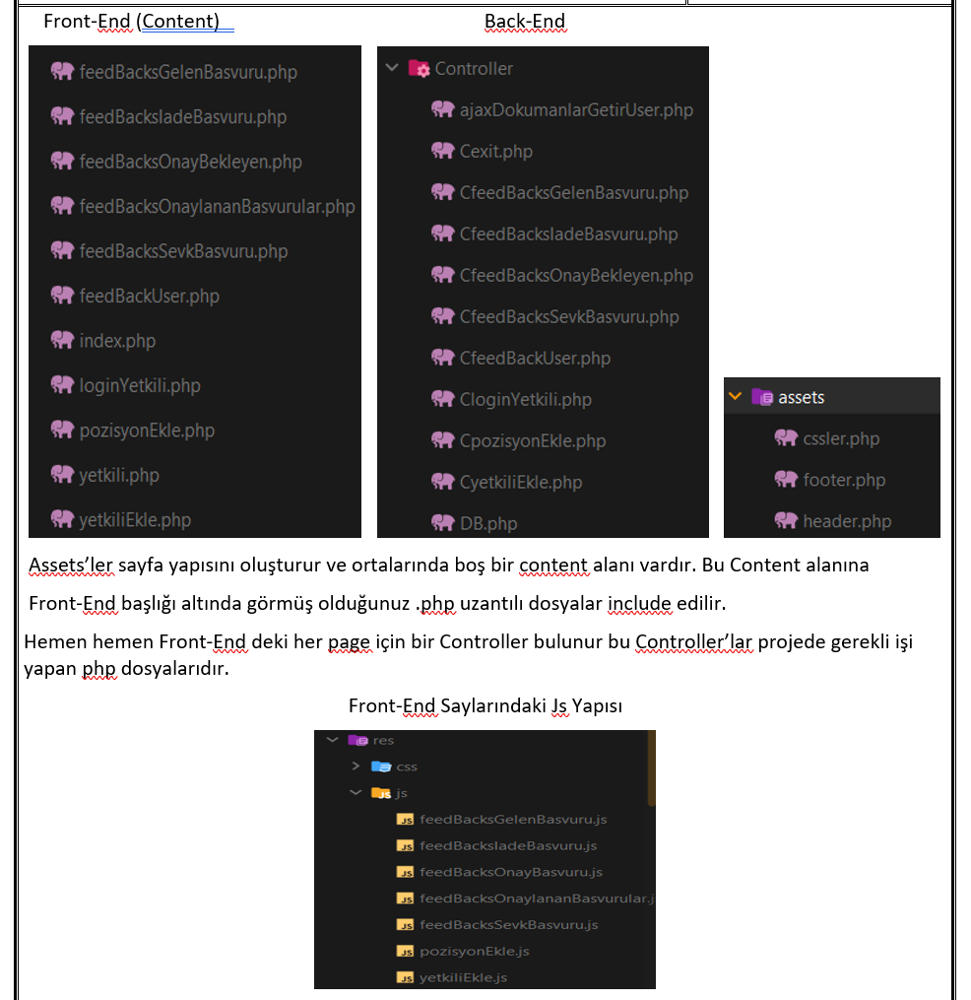

# Universite-Is-Talep-Takip  
UI kısmında hem web hem de telegram botu kullanılan bir web projesi.   
Bu proje şuan doktora tezi olarak geliştirilmeye devam edildiği için pek fazla bilgi paylaşamıyorum.   
Genel olarak projede iş-talep-takip sisteminin daha kullanışlı olması amaçladık. Bu nedenle Telegram API yardımıyla hem sistemdeki personellerin, hem adminlerin, hemde diğer kullanıcıların telegram bot üzerinden iş-talep-takip sistemini kullanmasını sağladık.   

<h4>Daha detaylı bilgi için ekteki raporumu okuyabilirsiniz.</h4>

   
Bu projede;
- Veri Tabanı Tasarımı,
- Veri Tabanı,
- Back-End,
- Front-End,
- Telegram Bot,
tarafımca yapılmıştır.
  
Sistemi kısaca anlatmak gerekirse örneğin:    
a)üniversitede bir sınıfta projeksiyon HDMI kablosunun ucu kırılmış olsun.    
b)Bunu fark eden kişi fotoğrafını çekip telegram botuna gönderiyor ve talebini yazıyor örn(Projeksiyon kablosu fotoğrafta görüldüğü üzere kırılmıştır, değiştirmenizi talep ediyorum).    
c)Daha sonra bu talep , talepleri dağıtan birimin önüne düşüyor ve bu birim talebi ilgili başkanlığa yönlendiriyor    
d)İlgili başkanlık, gelen talebi; ilgili müdürlüğe veya direkt ilgili personele yönelendiyor.    
e)Önüne iş talebi düşen personel, olay yerine gidip sorunu çözüyor ve telegram bot üzerinden ilgili adımları takip ederek talebi kapatıyor. Bu kapatma işleminde  projeksiyonun çalıştığına dair bir fotoğrafı bota yolluyor ve gerekli açıklamayı bota yazıyor.    
d)Gönderilen fotoğraf ve mesajla birlikte talep kapanıyor ve onaylanmak üzere bir üst birime düşüyor.    
f)Bir üst birim cevabı yetersiz bulup, talebi ilgili personele geri yollayabilir veya onaylar.    
g)Talep onaylandığı durumda, talebin cevabı ve ekleri(ses,konum,fotoğraf,belge); talebi açmış olan kullanıcıya telegram üzerinden mesaj olarak iletiyor.  
(gg/aa/yyyy tarihli talebiniz kapanmıştır vs....).    
Not: Geliştirmiş olduğum bu projede yukarıda bahsi geçen işlemler aynı zamanda web üzerinden de yapılabiliyor, fakat fotoğraf çekip yollama gibi işlemlerin kolaylaştırması açısından telegram bot daha pratik oluyor.    
Not-2: Personel ve Adminler telegram botta bir sefere mahsus oturum açıyor. Bu oturum tek kullanımlık bir key yardımıyla açılıyor. Bu konuda detaylı anlatım raporumda mevcuttur.    
Daha detaylı bilgi için ekteki raporumu okuyabilirsiniz.   
Hala sorularınız varsa bana mailimden ulaşabilirsiniz.   

<ol>
  <li>
      <h3 color="Red">Rapordan Görseller:</h3>
      <ul>        
        <li></li> 
        <li></li>
        <li></li>
        <li></li>
        <li></li>
        <li></li>
        <li></li>
        <li></li>
      </ul>
  </li>
</ol>
